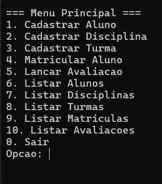
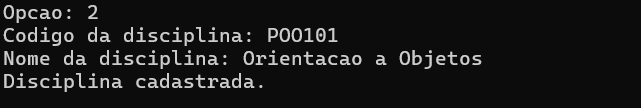
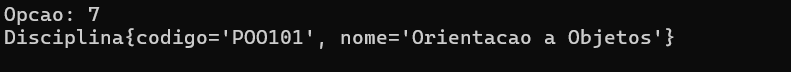

# 📚 Sistema Acadêmico - FCTE

## 📝 Descrição do Projeto

Desenvolvimento de um sistema acadêmico para gerenciar alunos, disciplinas, turmas, matrículas e avaliações, utilizando os conceitos de **orientação a objetos** — **herança, polimorfismo e encapsulamento** —, além de **persistência de dados em arquivos CSV**.

Este sistema permite o cadastro de alunos (normais ou especiais), disciplinas, turmas, lançamento de avaliações e controle de matrícula com validação de vagas e limites máximos.

---

## 👨‍🎓 Dados do Aluno

- **Nome completo:** [Cecília Costa Rebelo Cunha]
- **Matrícula:** [232001415]
- **Curso:** [Engenharia de Software]
- **Turma:** [T06]

---

## ⚙️ Instruções para Compilação e Execução

### ✅ Compilação

Execute o seguinte comando no terminal, dentro da pasta raiz do projeto:

```bash
javac -d bin src/models/*.java src/managers/*.java src/App.java
```

### ▶️ Execução

Execute o programa com:

```bash
java -cp bin App
```

> ⚠️ Certifique-se de estar na pasta raiz do projeto ao executar esse comando.

---

## 📂 Estrutura de Pastas

ep1-OO-2025_1/
├── prints/             # Prints de tela para o README ou entrega
├── src/                # Código fonte Java
│   ├── models/         # Classes de modelo (Aluno, Turma, Avaliacao, etc.)
│   ├── managers/       # Classes que gerenciam os modelos (CRUD)
│   └── App.java        # Classe principal (main)
├── README.md           # Documento de descrição do projeto
├── .gitignore          # Arquivos/pastas ignorados pelo Git


---

## ☕️ Versão do JAVA utilizada

- Java **21**

---

## 🎥 Vídeo de Demonstração

📺 [(https://drive.google.com/file/d/19ICDh-oZOkKvOmznszTDKbVr5gI3c0o6/view?usp=drive_link)]

---

## 🖼️ Prints da Execução

### 🔸 Menu Principal



### 🔸 Cadastro de Aluno



### 🔸 Lista de Disciplinas



---

## 🚀 Principais Funcionalidades Implementadas

- ✅ Cadastro e listagem de alunos (**normais e especiais**)
- ✅ Cadastro de disciplinas
- ✅ Cadastro de turmas (com controle de vagas)
- ✅ Matrícula de alunos em turmas, respeitando:
  - Limite de matrículas (6 para aluno normal, 8 para especial)
  - Disponibilidade de vagas
- ✅ Lançamento de **notas** e **presença (%)**
- ✅ Listagem de avaliações
- ✅ Armazenamento persistente dos dados em arquivos CSV
- ✅ Uso dos pilares da **orientação a objetos**:
  - **Herança:** Aluno especial herda de aluno
  - **Encapsulamento:** Atributos privados, acesso por getters e setters
  - **Polimorfismo:** Operações comuns entre classes (ex.: listagem)
- ✅ Validação de dados e mensagens de erro amigáveis

---

## 💡 Observações (Extras ou Dificuldades)

- 💪 Desafio principal foi gerenciar a lógica de matrícula com verificação de limites de alunos normais e especiais, além da persistência correta nos arquivos CSV.
- 🚀 Implementação focada em funcionamento robusto no terminal.
- 🔥 Dificuldades enfrentadas na conciliação entre herança e serialização CSV foram superadas.

---

## 📬 Contato

- cecilia.cunha2004@gmail.com
